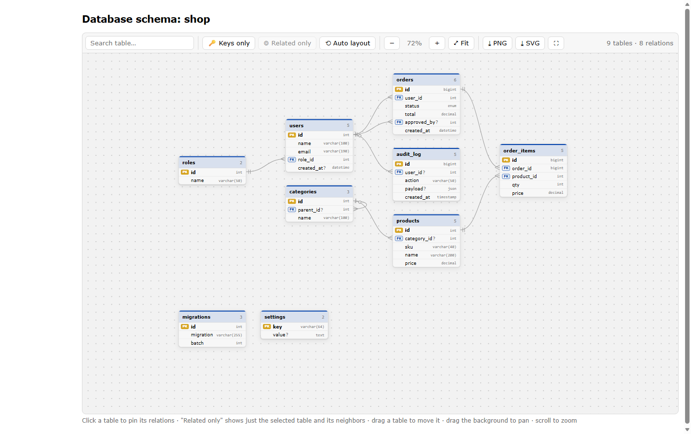
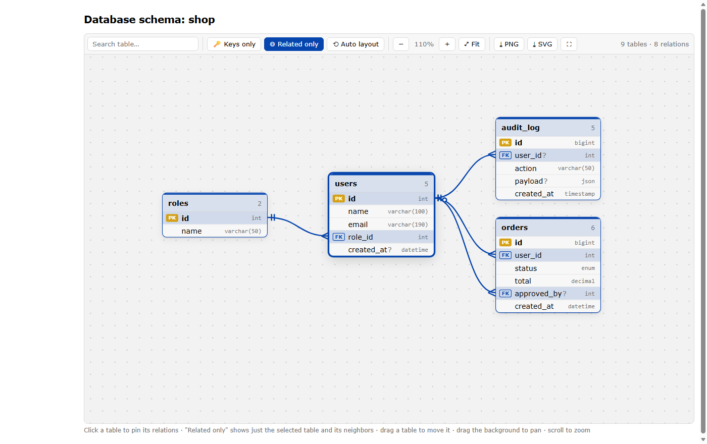
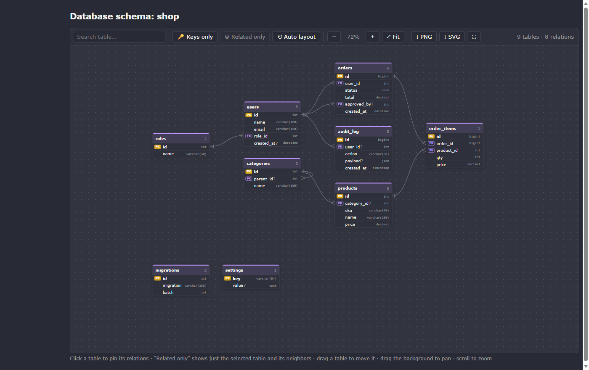

# Adminer Schema Diagram

Plugin Adminer 5 yang mengganti halaman **Database schema** bawaan dengan diagram ER yang
modern dan interaktif: kartu tabel dengan badge PK/FK, garis relasi melengkung bernotasi
crow's foot, tata letak otomatis, klik untuk menyalakan relasi, mode fokus satu tabel, dan
export PNG/SVG.

Semuanya berjalan di browser memakai data yang memang sudah dimiliki Adminer. Tanpa proses
build, tanpa koneksi ke layanan luar, tanpa tabel tambahan — cukup satu file PHP.

*[Read in English](README.md)*



## Fitur

- **Kartu tabel** berisi daftar kolom, badge `PK` / `FK`, tipe data, dan tanda `?` untuk
  kolom yang boleh NULL. Nama tabel bisa diklik untuk membuka halaman strukturnya, angka
  di kanan adalah jumlah kolom, dan komentar tabel tampil sebagai tooltip.
- **Garis relasi crow's foot** berbentuk kurva, menempel tepat di kolom yang berelasi.
  Sisi tabel anak memakai kaki gagak yang berarti "banyak". Sisi tabel induk berarti
  "tepat satu", atau "nol atau satu" kalau kolom foreign key-nya boleh NULL.
- **Tata letak otomatis berlapis.** Tabel yang dirujuk di kiri, tabel yang merujuk di
  kanan, dan urutan di tiap kolom diatur supaya garisnya sesedikit mungkin bersilangan.
  Tabel tanpa relasi dikumpulkan dalam grid di bawah.
- **Klik tabel untuk menyalakan relasinya.** Garis, tabel terkait, dan kolom yang
  berelasi tetap menyala walaupun kursor tidak di atasnya, sementara tabel lain meredup.
  Klik lagi, klik latar, atau tekan `Esc` untuk mematikan.
- **Hanya terkait.** Setelah sebuah tabel dipilih, hanya tabel itu dan tetangga
  langsungnya yang tampil, tersusun rapi di sekelilingnya. Klik tetangganya untuk pindah
  fokus, jadi Anda bisa menelusuri relasi satu per satu. Keluar dari mode ini akan
  mengembalikan susunan yang tersimpan.
- **Kunci saja** menyembunyikan kolom non-kunci, supaya database besar tetap terbaca.
- **Pencarian tabel** berdasarkan nama. Tekan `Enter` untuk langsung ke hasil pertama.
- **Export** diagram yang sedang tampil sebagai **SVG** atau **PNG** resolusi 2×. Isinya
  sama persis dengan yang di layar, termasuk mode dan tema yang sedang aktif.
- **Seret, geser, zoom**, dan **layar penuh**. Posisi tabel dan tingkat zoom diingat per
  database.
- **Mengikuti tema aktif.** Warna diambil dari halaman yang sedang dirender, jadi tema
  terang, tema gelap, plugin `designs`, dan plugin `dark-switcher` semuanya cocok.

| Mode Hanya terkait | Tema gelap |
| --- | --- |
|  |  |

## Kebutuhan

- **Adminer 5.0 atau lebih baru**, karena plugin ini memakai namespace `Adminer\` yang
  mulai ada di versi 5.0. Plugin ini **tidak** jalan di Adminer 4.x.
- **PHP 7.2+**
- Browser versi baru. Tampilannya memakai CSS `color-mix()`, jadi minimal Chrome/Edge
  111+, Firefox 113+, atau Safari 16.2+.
- Garis relasi bergantung pada foreign key yang dilaporkan driver. Plugin ini dibuat dan
  diuji untuk **MySQL/MariaDB** dan **PostgreSQL**. Driver lain tetap menampilkan tabel
  beserta foreign key yang dilaporkannya. View tidak digambar, sama seperti halaman schema
  bawaan Adminer.

## Pemasangan

Unduh [`schema-diagram.php`](schema-diagram.php), lalu pilih **salah satu** cara berikut.

**Folder plugin otomatis (paling mudah).** Letakkan file itu di folder `adminer-plugins/`
yang sejajar dengan `adminer.php`:

```
adminer.php
adminer-plugins/
    schema-diagram.php
```

Adminer 5 memuat semua plugin di folder itu secara otomatis. Tidak ada yang perlu diatur.

**Daftar plugin manual.** Kalau Anda menyusun sendiri daftar plugin di
`adminer-plugins.php` atau di `adminer_object()`, nama kelasnya `AdminerSchemaDiagram`:

```php
return [
    new AdminerSchemaDiagram(),
];
```

Setelah itu buka salah satu database, lalu klik **Skema database**.

## Cara memakai

| Tindakan | Hasil |
| --- | --- |
| Klik tabel | Menyalakan relasi, tabel terkait, dan kolom yang berelasi |
| Klik lagi / klik latar / `Esc` | Mematikan pilihan |
| Arahkan kursor ke tabel | Menampilkan relasinya sekilas |
| Arahkan kursor ke garis | Menyorot dua kolom yang dihubungkan, tooltipnya berisi nama constraint |
| Klik garis relasi | Memusatkan tampilan ke tabel yang dirujuk |
| Klik nama tabel | Membuka struktur tabel di Adminer |
| Seret tabel | Memindahkannya, dan posisinya disimpan untuk database ini |
| Seret latar | Menggeser kanvas |
| Scroll | Zoom mengikuti posisi kursor |
| **Hanya terkait** | Menampilkan tabel terpilih beserta tetangga langsungnya saja |
| **Kunci saja** | Menyembunyikan kolom yang bukan bagian dari kunci |
| **Tata ulang** | Membuang posisi tersimpan dan menata diagram dari awal |
| **Pas layar** | Zoom supaya seluruh diagram terlihat |
| **PNG** / **SVG** | Mengunduh diagram yang sedang tampil |
| Pencarian + `Enter` | Memusatkan tampilan ke tabel hasil pertama |

Nama file hasil export: `schema-<database>.png`, atau `schema-<database>-<tabel>.png`
kalau diambil dari mode **Hanya terkait**.

## Cara kerjanya

Di halaman schema, hook `head()` plugin ini mengumpulkan tabel, kolom, dan foreign key
dari sumber yang sama dengan halaman schema bawaan Adminer, menyisipkannya sebagai JSON,
menyembunyikan diagram bawaan, lalu menggambar versinya sendiri. Tata letak, penyorotan,
dan export semuanya JavaScript biasa di halaman itu. Plugin tidak menjalankan query
tambahan setelah halaman dimuat, dan tidak menghubungi server pihak ketiga.

Posisi tabel, zoom, dan setelan **Kunci saja** disimpan di `localStorage` browser dengan
kunci `adminer-erd:<server>|<database>|<schema>`. Menghapus data browser atau menekan
**Tata ulang** akan mengembalikannya ke awal.

Export PNG/SVG menyusun file SVG mandiri dari tata letak yang sedang dirender, hanya
berisi bentuk dan teks biasa tanpa `foreignObject`, lalu untuk PNG diubah jadi raster
lewat `<canvas>`. Warnanya diambil dari halaman, jadi hasilnya sesuai tema Anda.

## Mengatasi masalah

**Warnanya aneh di tema buatan sendiri.** Plugin mengambil warna teks, latar, dan link
dari halaman. Tema yang memberi warna link sama dengan teks biasa akan memakai warna biru
bawaan. Silakan buka issue dengan menyebut nama temanya dan lampirkan screenshot.

**Ada relasi yang tidak muncul.** Yang digambar hanya foreign key di dalam database dan
schema yang sedang dibuka. Kunci yang menunjuk ke database lain dilewati, sama seperti di
diagram bawaan Adminer. Relasi yang hanya ada di kode aplikasi, tanpa `FOREIGN KEY` di
database, tidak bisa dideteksi.

**Database besar terasa berat atau sesak.** Nyalakan **Kunci saja**, pilih satu tabel lalu
pakai **Hanya terkait**, atau cari tabel yang Anda butuhkan. Setiap tabel adalah elemen
DOM, jadi ratusan tabel akan terasa lebih berat daripada belasan.

**Tidak ada yang berubah setelah dipasang.** Pastikan Adminer-nya versi 5, karena plugin
Adminer 4 tidak memakai namespace dan file ini tidak akan dimuat. Pastikan juga filenya
ada di folder yang memang dibaca Adminer. Cek juga console browser kalau ada error.

## Berkontribusi

Issue dan pull request dipersilakan. Plugin ini sengaja dibuat satu file mandiri. CSS dan
JS-nya ditaruh di heredoc di dalam kelas supaya pemasangannya cukup menyalin satu file.
Mohon dipertahankan seperti itu, ikuti gaya penulisan kode di sekitarnya (indentasi tab,
konvensi plugin Adminer), dan uji di tema terang maupun gelap sebelum mengirim perubahan.

## Lisensi

Lisensi ganda, sama seperti Adminer: [Apache License 2.0](LICENSE-APACHE) atau
[GPL versi 2](LICENSE-GPL), silakan pilih.

## Kredit

Dibuat untuk [Adminer](https://www.adminer.org/) karya Jakub Vrana. Notasi relasinya
mengikuti diagram ER crow's foot yang umum dipakai.
